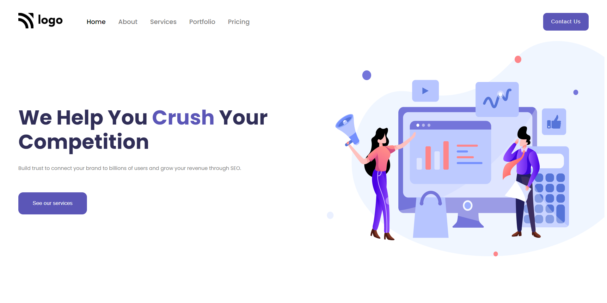

# HTML  and CSS 

# Project 4 - Web Service landing Page 

By Maulik Vadodariya

## [Link to the live Project](https://web-service-landing-page.netlify.app/) 

## What I learned from this Project?

- I have done this project using HTML and CSS only.
- In this project I learned about `nth-child` css.
 

## I spent 2 to 2.5 hours in making this project

